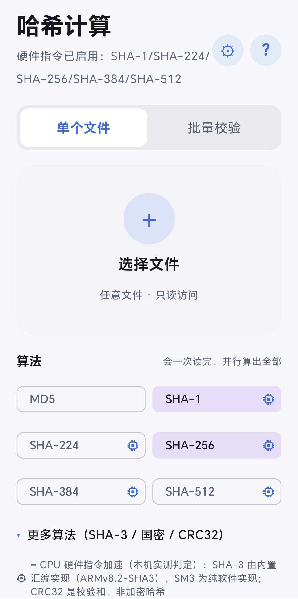
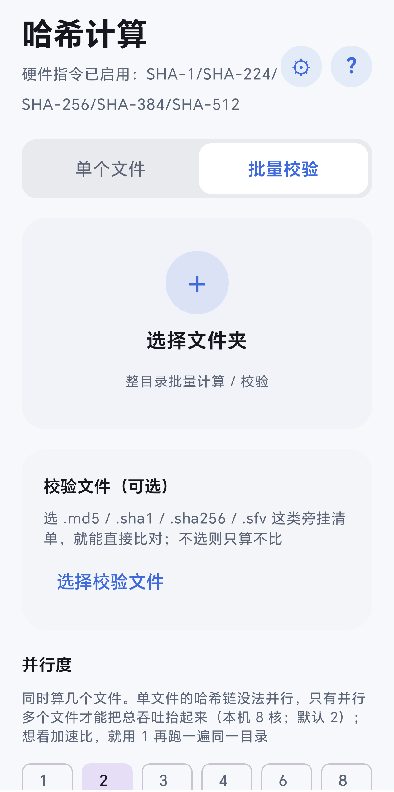
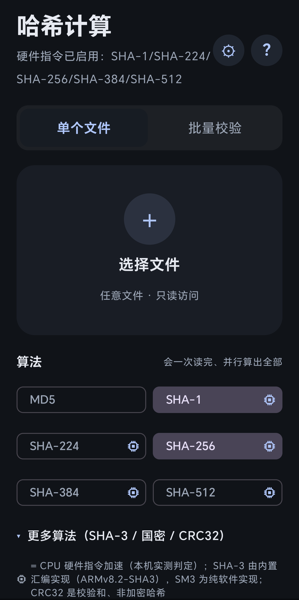

#  HashLite（哈希计算）

[**下载最新版本（Releases）**](https://github.com/Xiaokun19/hashlite/releases/latest)

轻量、干净的 Android 文件哈希计算 / 校验应用：10 个算法（含 SHA-3、SM3、CRC32）、
批量校验与多文件并行哈希。**不申请存储权限、不联网**，所有计算在本地完成，支持 Android 7.0+。

## 特性

- **算法（10 个）**：MD5 / SHA-1 / SHA-224 / 256 / 384 / 512 / SHA3-256 / SHA3-512 / SM3 / CRC32
  （SHA-3 内置 ARMv8.2 汇编实现，不可用时自动回退纯软件；CRC32 是校验和、非加密哈希）
- **单文件**：支持从其它应用「分享 / 打开」直达；流式哈希（4 MiB 块 + 预读线程），
  实时进度 / 速度 / 剩余时间；结果点按即复制；可粘贴任意格式校验值直接比对
- **批量校验**：整目录（含子目录）批量；可导入 .md5 / .sha1 / .sha256 / .sfv 清单比对；
  1–8 路并行；判定「匹配 / 不匹配 / 缺失 / 未列出 / 读取失败」；可导出校验文件
- **硬件加速**：自动检测 CPU 指令，并用微基准实测验证（「有指令 ≠ 用上指令」）
- **外观与语言**：浅色 / 深色 / 跟随系统；中文 / English
- **隐私**：文件经 SAF 只读访问，不申请存储权限；不申请网络权限，无任何数据上传
- **诊断日志**：崩溃与非致命错误自动记录，可一键导出，便于反馈问题

## 截图

| 单文件 | 批量校验 | 深色模式 |
|---|---|---|
|  |  |  |

## 性能：硬件加速 vs 纯软件

同一台设备、同一份数据，走 CPU 硬件指令和走纯软件实现（BouncyCastle / Java）的差距——这就是本应用坚持"两层判定"的理由（内存基准，来自项目测试机；不同机型数值会浮动）：

| 算法 | 硬件加速 | 纯软件实现 | 差距 |
|---|---|---|---|
| SHA-1 | ≈1.6–2.2 GB/s（平台硬件指令） | ≈0.16–0.19 GB/s | **约 10×** |
| SHA-256 | ≈1.5–2.7 GB/s（平台硬件指令） | ≈0.15–0.19 GB/s | **约 9–13×** |
| SHA-512 | ≈1.0–1.7 GB/s（平台硬件指令） | ≈0.09–0.18 GB/s | **约 7–13×** |
| SHA3-256 | ≈0.7–1.0 GB/s（内置 ARMv8.2 汇编） | ≈0.3 GB/s（BouncyCastle） | **约 2.3–2.8×** |
| CRC32 | 平台原生（zlib） | Java 查表实现 | **约 17–34×** |

实际意义：1 GB 的文件用 SHA-256 只要 **约 0.4–0.7 秒**；若只能走纯软件实现要 **约 5–7 秒**——大文件与批量校验能不能"日常可用"，差的就是这一点。

其它参考：

- 多文件并行：8 路聚合约 7.35 GB/s（16 × 64 MiB，页缓存命中）
- 硬件加速的判定：**CPU 指令检测 + 微基准实测，两层都通过才点亮徽标**（"有指令 ≠ 用上指令"）
- 测量条件与完整数据见设计文档 → [`hashlite/README.md`](hashlite/README.md)

## 安装

从 [**Releases 页面**](https://github.com/Xiaokun19/hashlite/releases/latest) 下载最新版：

- 文件名形如 `hashlite-x.y.z-arm64-v8a.apk`，仅支持 64 位 ARM 设备（Android 7.0+）
- 正式版使用独立签名；若安装过此前的 Debug 版，需先卸载再安装（应用只保存少量设置，影响很小）
- 也可自行构建（见下）；CI 会为每次提交构建 Debug APK，可从 GitHub Actions 运行记录下载 Artifacts

## 构建

- 要求：JDK 17；Android SDK（platforms;android-35）
- `./gradlew :hashlite:test :hashlite:assembleDebug`（56 个单元测试 + APK）
- native（SHA-3 汇编）默认不在本地编译，由 CI 以 `-Phashlite.native=true` 构建；
  本地构建自动回退纯软件实现，功能不受影响
- 在 ARM64 开发机上构建需先运行 `./setup_android_env.sh`（准备本机 aapt2）

## 项目结构

| 路径 | 说明 |
|---|---|
| `hashlite/` | 应用模块（本项目唯一模块） |
| `hashlite/README.md` | 设计文档：算法、加速检测、流式引擎、批量并行、实测数据 |
| `.github/workflows/ci.yml` | CI：单元测试 + 构建（含 native） |
| `.github/workflows/release.yml` | 发布：推送 `v*` 标签 → 构建签名 APK → Draft Release |
| `tools/aapt2/` | ARM64 开发环境用 aapt2 |
| `LICENSES/` · `THIRD_PARTY_NOTICES.md` | 第三方许可声明 |

## 已知限制

- 部分定制 ROM 在手动锁屏后会冻结后台计算；前台服务 / 唤醒锁 / 电池白名单只能缓解
- SM3 为纯软件实现（未做指令加速）

## 致谢与开发说明

- 本项目在 Android 端完成开发，借助 [Operit](https://github.com/AAswordman/Operit) 平台的
  AI 助手编写代码与文档；需求、设计取舍与测试验收由维护者负责。
- SHA-3 的 ARMv8 汇编来自 OpenSSL 3.0.13（Apache-2.0），详见 `THIRD_PARTY_NOTICES.md`。

## 许可证

MIT（见 [`LICENSE`](LICENSE)）。第三方组件与其许可见
[`THIRD_PARTY_NOTICES.md`](THIRD_PARTY_NOTICES.md) 与 [`LICENSES/`](LICENSES/)。
